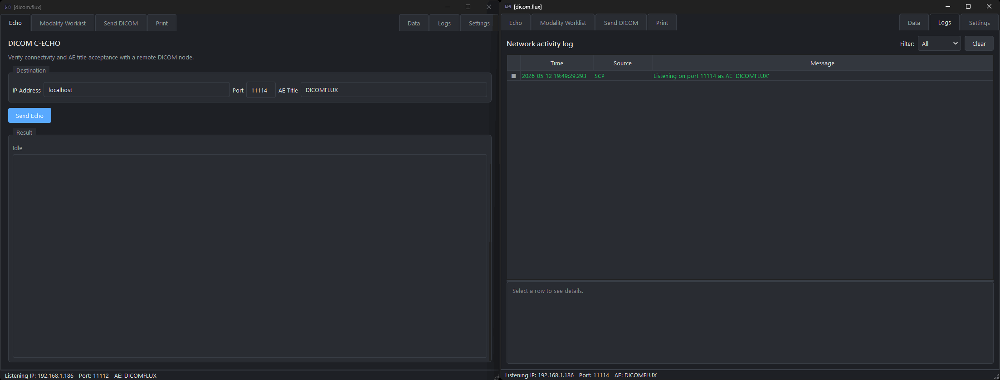
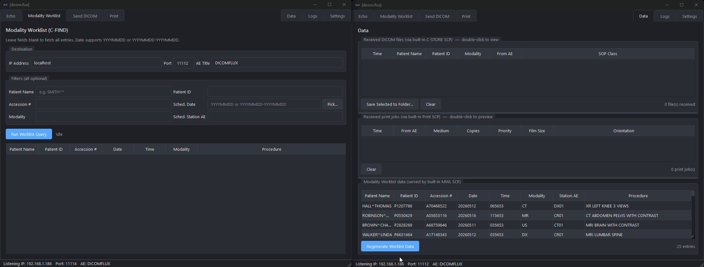
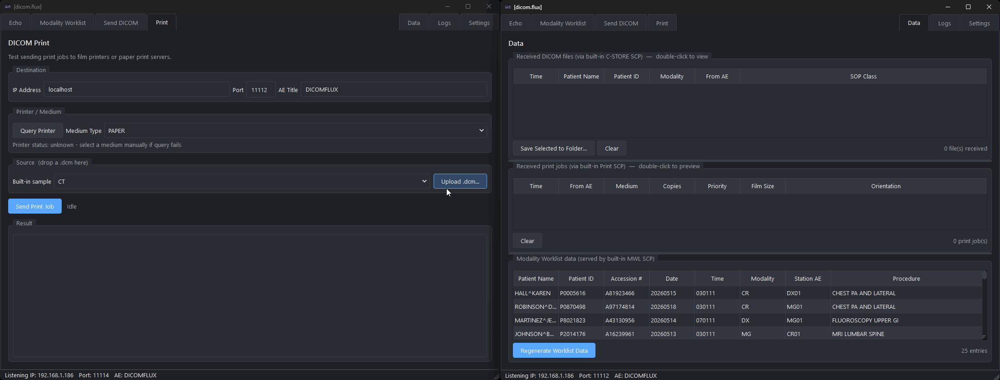

# dicom.flux

A portable single-file DICOM tester for Windows, Linux, and macOS. Sends and
receives C-ECHO, Modality Worklist (C-FIND), C-STORE, and DICOM Print, with a
built-in SCP listener so two instances can talk to each other on the network.

## Features

- **Echo** — C-ECHO connectivity test.
- **Modality Worklist** — query worklist providers (C-FIND).
- **Send DICOM** — built-in samples or upload your own `.dcm` / `.zip`.
- **Print** — send a print job (Basic Grayscale Print Management).
- **Built-in SCP** — always-on listener accepts Echo, MWL, storage, and print.
- **Data tab** — double-click a received file or print job to view it.
- **Settings** — AE title, port, theme, and optional Weasis path.

## Run from source

```bash
python -m venv .venv
# Windows:      .venv\Scripts\Activate.ps1
# Linux/macOS:  source .venv/bin/activate
pip install -r requirements.txt
python main.py
```

## Build a single-file executable

```bash
pip install pyinstaller
```

### Windows

```
pyinstaller --onefile --windowed --icon assets\dicom_flux.ico --add-data "assets\dicom_flux.svg;assets" --name "[dicom.flux]" main.py
```

### Linux

```
pyinstaller --onefile --add-data "assets/dicom_flux.svg:assets" --name "[dicom.flux]" main.py
```

### macOS

```
pyinstaller --onefile --windowed --add-data "assets/dicom_flux.svg:assets" --name "[dicom.flux]" main.py
```

The output is written to `dist/`.

## Demos

### Echo (C-ECHO)



### Modality Worklist (C-FIND)



### Send DICOM and Print


